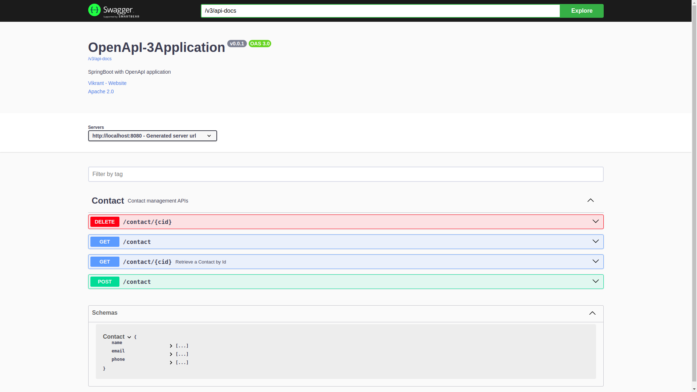

## Swagger OpenApi3 Documentation Visualization

## Getting Started
To get started with this project, you will need to have the following installed on your local machine:

* JDK 11+
* Maven 3+

        Swagger: is a specification for defining APIs (Application Programming Interfaces)Originally, 
        Swagger was a framework for API documentation and design, which included tools for generating interactive API 
        docs, code generation, and more. The Swagger specification, now known as Swagger 2.0, 
        was the standard for describing APIs before OpenAPI.
  
        OpenAPI Specification (OAS): The OpenAPI Specification is a more formal and standardized version of the 
        Swagger specification. In 2016, the Swagger Specification was donated to the Linux Foundation and became 
        part of the OpenAPI Initiative, which is now responsible for the specification's development and evolution. 
        The OpenAPI Specification (currently at version 3.x) represents a significant advancement over Swagger 2.0.

        OpenAPI 3: This is the 3rd version of the OpenAPI Specification and offers more advanced features and improvements 
        over Swagger 2.0. It provides a more powerful and flexible way to describe APIs, including better support for 
        component reusability, enhanced security definitions, and more detailed specification of request and response formats.

* Features

      API Documentation: Swagger/OpenAPI provides a structured and standardized way to document APIs. It allows developers 
      to define endpoints, request/response formats, authentication methods, error handling, parameters, 
      and It uses a JSON or YAML to describe the API and its docs. This documentation can be automatically generated 
      and made thus allows multiple developers or teams to collaborate on API development making it easier to understand and consume the API.
      
      Client SDK Generation: Swagger specifications can be used to generate client SDKs for various programming languages. 
      These SDKs provide pre-built code and functions that make it easier for developers to interact with the API.
      authentication, and error handling.
      
      Testing: Swagger/OpenAPI can be leveraged to generate automated tests for the API. By defining request/response examples 
      and expected behavior in the specification, developers can generate test cases that validate the API's functionality and performance. 
      Automated testing helps catch issues early in the development process and ensures the API behaves as expected.

      API Visualization: Swagger specifications can be used to generate interactive API documentation using tools like Swagger UI. 

## Technologies used
    Java-11+
    Spring-boot
    Open-API3(Swagger)

### Document REST API with Springboot 2(Open API 2) dependency
      <dependency>
          <groupId>org.springdoc</groupId>
          <artifactId>springdoc-openapi-ui</artifactId>
          <version>1.8.0</version>
      </dependency>

        or

    implementation 'org.springdoc:springdoc-openapi-ui:1.8.0'

### Document REST API with Springboot 3(Open API 3) dependency
      <dependency>
          <groupId>org.springdoc</groupId>
          <artifactId>springdoc-openapi-starter-webmvc-ui</artifactId>
          <version>2.6.0</version>
      </dependency>

        or

    implementation 'org.springdoc:springdoc-openapi-starter-webmvc-ui:2.6.0'

## Build and Run the project, follow these steps
* Locally
    - Clone the repository: `git clone https://github.com/vikrantgit97/OpenApi-Documentation.git`
    - Navigate to the project directory
    - Build the project: `mvn clean install`
    - Run `mvn clean package spring-boot:run` to build the artifact and run the application
## Documentation (Swagger)
[SwaggerDocumentation_SpringBoot_Application](http://localhost:8080/swagger-ui/index.html) to visualize the exposed API
- Swagger UI: `http://server:port/swagger-ui.html`
- OpenAPI `http://server:port/v3/api-docs`
### SpringBoot with Swagger(Open API) Documentation references
1)[Swagger (official site)](https://swagger.io/)

2)[Setting Up Swagger 2 with a Spring REST API Using Springfox](https://www.baeldung.com/swagger-2-documentation-for-spring-rest-api)

3)[Spring Boot REST API Documentation with Swagger](https://levelup.gitconnected.com/spring-boot-rest-api-documentation-with-swagger-cab4d865a15d)

4)[API Documentation using Swagger 3 with Spring Boot 2 + Spring Security](https://medium.com/javarevisited/api-documentation-using-swagger-3-with-spring-boot-2-spring-security-5a0d2b0996ee)

5)[Spring Boot and Swagger — Writing Good API Documentations](https://betterprogramming.pub/spring-boot-swagger-api-documentation-249b3cad7d9c)

6)[https://spring.io/projects/spring-restdocs (by Spring official)](https://spring.io/projects/spring-restdocs)

7)[spring-doc-openapi v1.8.0](https://springdoc.org/)

8)[Swagger](https://swagger.io/specification/)

9)[OpenAPI 3](https://spec.openapis.org/oas/latest.html)

9)[Spring Boot + Swagger 3 example (with OpenAPI 3)](https://www.bezkoder.com/spring-boot-swagger-3/)

Install any **LINUX OS** or Ubuntu for Development Recommended.
    (https://releases.ubuntu.com)
  